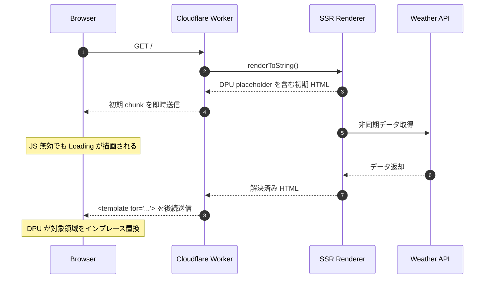

# Remix 3 + Declarative Partial Updates 天気予報デモ

Remix 3 (`remix/ui`) の VDOM と、Chrome 系ブラウザの実験的機能 **Declarative Partial Updates (DPU)** を組み合わせた、JavaScript なしでも初期 SSR の非同期部分更新を体験できるデモです。

Cloudflare Workers 上で SSR HTML をストリーミングし、初期チャンクでは `Loading...` を即座に表示します。データ取得が完了すると、後続チャンクで `<template for="...">` を流し、DPU 対応ブラウザが `<?start ... ?>` で囲まれた領域を JavaScript なしで置換します。

JS が有効な場合は、SSR データを引き継いでクライアント側 Remix UI アプリとして動作します。

## アーキテクチャ



## 実装の要点

### 1. SSRFetch

[src/provider/SSRProvider.tsx](./src/provider/SSRProvider.tsx) の `<SSRFetch>` は、サーバー描画時に fetch Promise を開始しますが、初期 HTML では待機しません。

代わりに、DPU 用の placeholder を直接出力します。

```html
<?start name="ssr-0"><div>Loading...</div><?end>
```

クライアント側では、`__REMIX3_SSR__` に保存された SSR データを読んで `finished` 状態として再描画します。

### 2. 手動ストリーミング SSR

[src/server.tsx](./src/server.tsx) では `renderToString()` で初期 HTML を作り、`TransformStream` の writer に直接書き込みます。

1. 初期 HTML を即 `writer.write()`
2. 各 `SSRFetch` の Promise 完了を待つ
3. 解決済み UI を `renderToString()` で HTML 化
4. `<template for="...">...</template>` を後続 chunk として送信
5. 最後に `__REMIX3_SSR__` と `</body></html>` を送信

wrangler dev で小さい chunk がバッファされるのを避けるため、初期 HTML には無害な HTML コメント padding を足し、レスポンスには `Content-Encoding: identity` を設定しています。

### 3. Worker

[worker/app.ts](./worker/app.ts) は Hono の入口です。現在は Remix 3 の frame 出力を変換していません。DPU HTML は `src/server.tsx` が直接生成し、Worker は HTML stream をそのまま返します。

HTML レスポンスには以下を設定します。

```http
Cache-Control: no-cache, no-transform
X-Content-Type-Options: nosniff
Content-Encoding: identity
```

### 4. Workers Assets

`/weather/:id` のような SSR ルートは静的アセットとして 404 にならないよう、[wrangler.toml](./wrangler.toml) で Worker 優先にしています。

```toml
[assets]
directory = "./dist/assets"
binding = "ASSETS"
run_worker_first = ["/weather/*"]
```

## セットアップ

```bash
pnpm install
```

## 起動

```bash
pnpm run start
```

ローカル URL:

```text
http://127.0.0.1:8787
http://127.0.0.1:8787/weather/100000
```

## 検証

```bash
pnpm exec tsc -b
pnpm run build
```

ストリーミング確認用に `src/routes/index.tsx` の `action` 内で次のような wait を入れると、初期 chunk と後続 template の分離を確認できます。

```ts
await new Promise((r) => setTimeout(r, 2000));
```

期待される挙動:

- 初期 chunk はデータ取得を待たずに返る
- 初期 chunk には `Loading...` と `<?start name="...">` が含まれる
- データ取得後に `<template for="...">` が後続 chunk として流れる
- JS 無効時でも DPU 対応ブラウザなら表示が差し替わる

## ブラウザ要件

JS 無効時の DPU 置換を見るには、Chrome 系ブラウザで以下を有効化してください。

```text
chrome://flags/#enable-experimental-web-platform-features
```

JS 有効時は `src/client.tsx` が SSR データを退避してから body を再マウントします。これにより、DPU で表示された SSR DOM とクライアント描画が二重に表示されるのを避けています。
