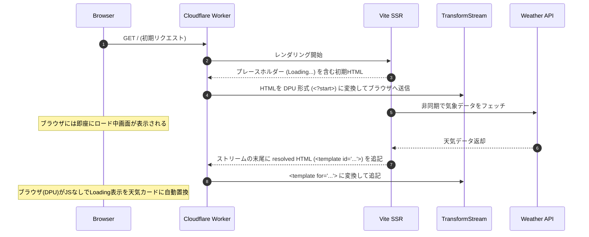

# Remix 3 + Declarative Partial Updates 天気予報デモ

本プロジェクトは、軽量 VDOM フレームワーク **Remix 3** (`@remix-run/ui`) の Out-of-order ストリーミング SSR と、ブラウザの実験的機能 **Declarative Partial Updates (DPU)** を融合させたハイブリッドデモです。

Cloudflare Workers (Hono) の配信レイヤーで `TransformStream` を使用して Remix 3 の出力を DPU 形式に動的変換することで、以下を両立します。

1. **JSロード前/JS無効時**: ブラウザの標準機能（実験的機能）による JS 不要の非同期ストリーミング部分更新（Out-of-order ストリームの自動インプレース置換）。
2. **JSロード完了後**: Remix 3 本来の高速で滑らかな SPA ナビゲーションおよびクライアントハイドレーション。

## アーキテクチャ



### ① Vite SSR & Remix 3 (VDOM)
*   サーバーサイドで `<RouterProvider>` と `<SSRProvider>` がアプリ全体の JSX をレンダリング。
*   `<SSRFetch>` を使った非同期データ取得（気象庁の API フェッチなど）の待機中、プレースホルダーとして `<Frame fallback={<div>Loading...</div>}>` を先に送信し、データが解決され次第、ストリームの末尾に実際のコンテンツ（`<template id="frameId">`）を追記します。

### ② TransformStream による DPU 変換ブリッジ
*   [worker/app.ts](file:///c:/prog/test/out-of-order-streaming3/worker/app.ts) にてレスポンスストリームをインターセプト。
*   `<!-- rmx:f:id -->` コメントを `<?start name="id">` に変換。
*   `<!-- /rmx:f -->` コメントを `<?end>` に変換。
*   `<template id="id">` を `<template for="id"><?start name="id">...<?end></template>` に変換してストリームへ送出。
*   また、パッケージのバージョン不整合を避けるため、`pnpm.overrides` で `@remix-run/ui` を `0.2.0` に固定しています。

### ③ ブラウザ側での置換
*   `chrome://flags/#enable-experimental-web-platform-features` を有効にした Chrome 系のブラウザは、JS が無効であっても、ストリームに流れてくる `<template for="id">` を自動検知して `<?start>` で囲まれた部分をインプレースで置換します。
*   JS が有効な場合は、`client.tsx` が起動してハイドレーションし、以降は Remix 3 の SPA として高速に動作します。

## セットアップ

```bash
pnpm install
```

### 開発・検証の起動

Vite 開発サーバー (`pnpm run dev`) では HTML ストリーミングのバッファリングが本番と異なり DPU の挙動を正確に再現できない場合があります。動作確認には必ず **Start スクリプト** (Wrangler dev) を使用してください。

```bash
pnpm run start
```

ローカル URL: `http://localhost:8787`

## ブラウザ要件

このデモの「JS無効時のストリーミング部分更新」を体験するには、Chrome 系ブラウザで以下を有効化してください。

*   `chrome://flags/#enable-experimental-web-platform-features`
